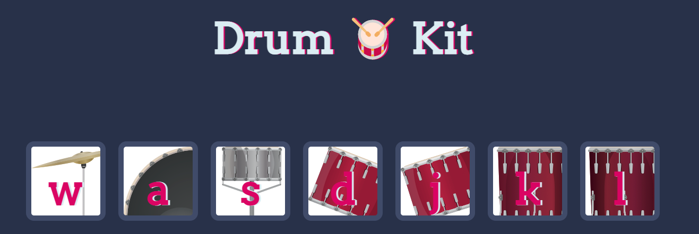
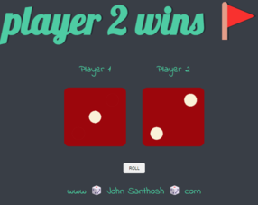

# JS GAMES

## This Repo has some of my mini games which I built using **JavaScript**

&nbsp;

## The simon game [live](1_Simon_Game\index.html)

&nbsp;

- The main idea of this game is to remember the sequence of the computer and repeat the sequence in correct oder

- This game mainly uses `arrays` to store the the input sequence from the user and the computer

- For every input, the game compare the values of user sequence with computer sequence

&nbsp;

---

## drum kit preview [live](2%20drum%20kit/index.html)

---

&nbsp;

## The Dice game [live](3%20Dicee%20Game/index.html)

&nbsp;

- When you have hard time to make a quick decision, The dice comes for the rescue

- In this game i've used a **_function(random)_** that create a random number and make the dice roll

- Used animations and **_setTimeout()_** function to mke the app more alive
